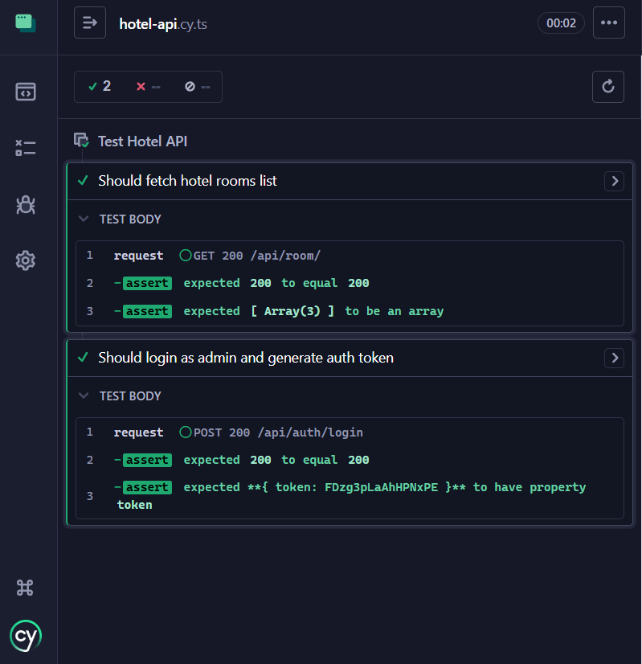
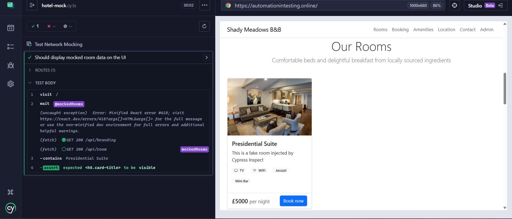

# 🌐 Cypress Hybrid API & Mocking Framework

A specialized test automation framework demonstrating **Direct API Testing** and **Frontend Isolation (Network Mocking)** using Cypress and TypeScript. Built against the Restful-Booker Platform.

## 🎯 Purpose of this Project
While UI testing is essential, it can be slow and flaky. This project showcases how to achieve faster, more reliable testing by:
1. **API Testing:** Interacting directly with the backend to validate status codes, JSON responses, and Auth Tokens.
2. **Network Mocking (`cy.intercept`):** Intercepting real API calls from the UI and injecting mock data (stubbing) to test edge cases without relying on the backend database.

## 🛠️ Tech Stack & Architecture
* **Tool:** Cypress
* **Language:** TypeScript
* **Target Application:** Restful-Booker Platform (React-based Hotel Booking App)
* **Key Cypress Commands:** `cy.request()`, `cy.intercept()`, `cy.wait()`

---

## 🚀 Key Features Implemented

### 1. Direct API Testing & Authentication
Bypassed the UI to test endpoints directly. Successfully implemented a POST request to login as an admin, retrieve the **JWT Auth Token**, and validate the response structure.

### 2. Frontend Isolation via Network Mocking
Used `cy.intercept()` to catch the GET request fetching hotel rooms and injected a fake `$5000 Cypress Presidential Suite`. This proves the ability to test UI edge-cases by controlling the network layer.
*(Note: Implemented `uncaught:exception` handling to bypass React hydration errors caused by injected data).*

---

## 📂 Framework Structure
- `cypress/e2e/api/` - Contains direct API tests (`cy.request`)
- `cypress/e2e/mocking/` - Contains network intercept tests (`cy.intercept`)
- `cypress.config.ts` - Base URLs and environment configurations

## 💻 How to Run Locally
1. Clone the repository.
2. Install dependencies: `npm install`
3. Run tests via Cypress UI: `npx cypress open`
4. Execute in terminal: `npx cypress run`